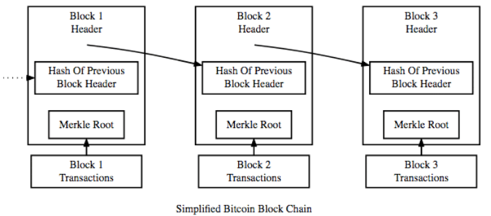
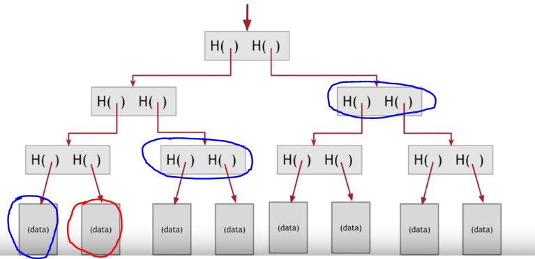
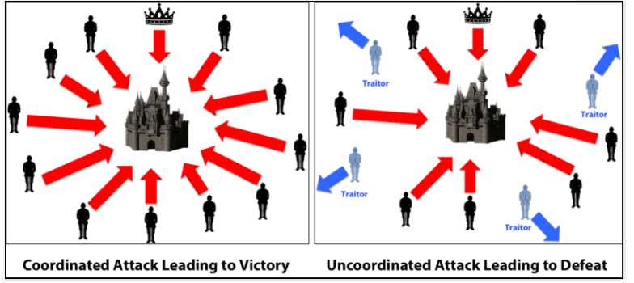
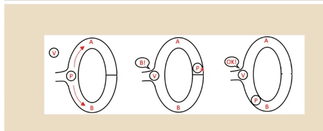

---
title: 区块链密码学
date: "2019-01-28 14:00:00"
categories:
- 区块链
- 区块链概念
tags:
- 区块链
toc: true
typora-root-url: ..\..\..
---

## 密码学算法

### Hash算法

**定义**

Hash（哈希或散列）算法，又常被称为指纹（fingerprint）或摘要（digest）算法，是非常基础也非常重要的一类算法。可以将任意长度的二进制明文串映射为较短的（通常是固定长度的）二进制串（Hash 值），并且不同的明文很难映射为相同的 Hash 值，且算法不可逆，例如: MD5、SHA-1、SHA-2、SHA-256；

比如判断两个字符串是否相等，只需要判断两字符串的hash值是否相等就可以基本断定两字符串是否相等；

Hash 算法并不是一种加密算法，不能用于对信息的保护。但 Hash 算法可被应用到对登录口令的保存上。例如网站登录时需要验证用户名和密码，如果网站后台直接保存用户的口令原文，一旦发生数据库泄露后果不堪设想（事实上，网站数据库泄露事件在国内外都不少见）。利用 Hash 的防碰撞特性，后台数据库可以仅保存用户口令的 Hash 值，这样每次通过 Hash 值比对，即可判断输入口令是否正确。即便数据库泄露了，攻击者也无法轻易从 Hash 值还原回口令。

**性质**

- 正向快速：给定原文和 Hash 算法，在有限时间和有限资源内能计算得到 Hash 值；
- 逆向困难：给定（若干）Hash 值，在有限时间内无法（基本不可能）逆推出原文；
- 输入敏感：原始输入信息发生任何改变，新产生的 Hash 值都应该发生很大变化；
- 碰撞避免：很难找到两段内容不同的明文，使得它们的 Hash 值一致（即发生碰撞）。

**常见hash算法**

目前常见的 Hash 算法包括国际上的 Message Digest（MD）系列和 Secure Hash Algorithm（SHA）系列算法，以及国内的 SM3 算法。

MD 算法主要包括 MD4 和 MD5 两个算法。MD4（RFC 1320）是 MIT 的 Ronald L. Rivest 在 1990 年设计的，其输出为 128 位。MD4 已证明不够安全。MD5（RFC 1321）是 Rivest 于 1991 年对 MD4 的改进版本。它对输入仍以 512 位进行分组，其输出是 128 位。MD5 比 MD4 更加安全，但过程更加复杂，计算速度要慢一点。MD5 已于 2004 年被成功碰撞，其安全性已不足应用于商业场景。。

SHA 算法由美国国家标准与技术院（National Institute of Standards and Technology，NIST）征集制定。首个实现 SHA-0 算法于 1993 年问世，1998 年即遭破解。随后的修订版本 SHA-1 算法在 1995 年面世，它的输出为长度 160 位的 Hash 值，安全性更好。SHA-1 设计采用了 MD4 算法类似原理。SHA-1 已于 2005 年被成功碰撞，意味着无法满足商用需求。

为了提高安全性，NIST 后来制定出更安全的 SHA-224、SHA-256、SHA-384，和 SHA-512 算法（统称为 SHA-2 算法）。新一代的 SHA-3 相关算法也正在研究中。

目前， MD5和SHA1已经被破解，一半推荐使用SHA2-256或更安全的算法

### 对称加密算法

**定义**

对称加密算法，顾名思义，加密和解密过程的密钥是相同的。该类算法的优点是加解密效率，和加密强度强度都很高。

缺点是参与方需要提前持有密钥，一旦有人泄露则系统安全性被破坏；另外如何在不安全通道中提前分发密钥也是个问题，需要借助额外的 Diffie–Hellman 协商协议或非对称加密算法来实现。

对称密码从实现原理上可以分为两种：分组密码和序列密码。前者将明文切分为定长数据块作为基本加密单位，应用最为广泛。后者则每次只对一个字节或字符进行加密处理，且密码不断变化，只用在一些特定领域（如数字媒介的加密）。

**分组对称加密算法**

- DES（Data Encryption Standard）：经典的分组加密算法，最早是 1977 年美国联邦信息处理标准（FIPS）采用 FIPS-46-3，将 64 位明文加密为 64 位的密文。其密钥长度为 64 位（包括 8 位校验码），现在已经很容易被暴力破解；
- 3DES：三重 DES 操作：加密 --> 解密 --> 加密，处理过程和加密强度优于 DES，但现在也被认为不够安全；
- AES（Advanced Encryption Standard）：由美国国家标准研究所（NIST）采用，取代 DES 成为对称加密实现的标准，1997~2000 年 NIST 从 15 个候选算法中评选 Rijndael 算法（由比利时密码学家 Joan Daemon 和 Vincent Rijmen 发明）作为 AES，标准为 FIPS-197。AES 也是分组算法，分组长度为 128、192、256 位三种。AES 的优势在于处理速度快，整个过程可以数学化描述，目前尚未有有效的破解手段；
- IDEA（International Data Encryption Algorithm）：1991 年由密码学家 James Massey 与来学嘉共同提出。设计类似于 3DES，密钥长度增加到 128 位，具有更好的加密强度。

**序列加密算法**

- RC4算法: 可以通过“一次性密码本”的对称加密处理。即通信双方每次使用跟明文等长的随机密钥串对明文进行加密处理。序列密码采用了类似的思想，每次通过伪随机数生成器来生成伪随机密钥串。

**加解密原理**

- 用相同的密钥对原文进行加密和解密
- 加密过程: 密钥 + 原文 => 密文
- 解密过程: 密文 + 密钥 => 原文

**缺点**

- 无法确保密钥被安全的传递
- 无法保证数据不会被篡改

### 非对称加密

**定义**

非对称加密是现代密码学的伟大发明，它有效解决了对称加密需要安全分发密钥的问题。

顾名思义，非对称加密中，加密密钥和解密密钥是不同的，分别被称为公钥（Public Key）和私钥（Private Key）。私钥一般通过随机数算法生成，公钥可以根据私钥生成。

其中，公钥一般是公开的，他人可获取的；私钥则是个人持有并且要严密保护，不能被他人获取。

非对称加密算法优点是公私钥分开，无需安全通道来分发密钥。缺点是处理速度（特别是生成密钥和解密过程）往往比较慢，一般比对称加解密算法慢 2~3 个数量级；同时加密强度也往往不如对称加密。

非对称加密算法的安全性往往基于数学问题，包括大数质因子分解、离散对数、椭圆曲线等经典数学难题。

代表算法包括：RSA、ElGamal、椭圆曲线（Elliptic Curve Crytosystems，ECC）、SM2 等系列算法。

**常用非对称加密算法**

- RSA：经典的公钥算法，1978 年由 Ron Rivest、Adi Shamir、Leonard Adleman 共同提出，三人于 2002 年因此获得图灵奖。算法利用了对大数进行质因子分解困难的特性，但目前还没有数学证明两者难度等价，或许存在未知算法可以绕过大数分解而进行解密。
- ElGamal：由 Taher ElGamal 设计，利用了模运算下求离散对数困难的特性，比 RSA 产生密钥更快。被应用在 PGP 等安全工具中。
- 椭圆曲线算法（Elliptic Curve Cryptography，ECC）：应用最广也是强度最早的系列算法，基于对椭圆曲线上特定点进行特殊乘法逆运算（求离散对数）难以计算的特性。最早在 1985 年由 Neal Koblitz 和 Victor Miller 分别独立提出。ECC 系列算法具有多种国际标准（包括 ANSI X9.63、NIST FIPS 186-2、IEEE 1363-2000、ISO/IEC 14888-3 等），一般被认为具备较高的安全性，但加解密过程比较费时。其中，密码学家 Daniel J.Bernstein 于 2006 年提出的 Curve25519/Ed25519/X25519 等算法（分别解决加密、签名和密钥交换），由于其设计完全公开、性能突出等特点，近些年引起了广泛关注和应用。
- SM2（ShangMi 2）：中国国家商用密码系列算法标准，由中国密码管理局于 2010 年 12 月 17 日发布，同样基于椭圆曲线算法，一般认为其安全强度优于 RSA 系列算法。

> 非对称加密算法适用于签名场景或密钥协商过程，但不适于大量数据的加解密。除了 SM2 之外，大部分算法的签名速度要比验签速度慢（1~2个数量级）。
>
> RSA 类算法被认为已经很难抵御现代计算设备的破解，一般推荐商用场景下密钥至少为 2048 位。如果采用安全强度更高的椭圆曲线算法，256 位密钥即可满足绝大部分安全需求。

**性质**

- 公钥用于加密, 私钥用于解密
- 公钥由私钥生成，私钥可以推导出公钥
- 从公钥无法推导出私钥

**优点**

- 解决了密钥传输中的安全性问题
- 解决了数据源确定性的问题

**缺点**

- 没有解决数据可以中途被篡改的问题

### 消息认证码与数字签名

消息认证码和数字签名技术通过对消息的摘要进行加密，可以防止消息被篡改和认证身份。

#### 消息认证码

**定义**

消息认证码（Hash-based Message Authentication Code，HMAC），利用对称加密，对消息完整性（Integrity）进行保护。

基本过程为对某个消息，利用提前共享的对称密钥和 Hash 算法进行处理，得到 HMAC 值。该 HMAC 值持有方可以向对方证明自己拥有某个对称密钥，并且确保所传输消息内容未被篡改。

典型的 HMAC 生成算法包括 K，H，M 三个参数。K 为提前共享的对称密钥，H 为提前商定的 Hash 算法（如 SHA-256），M 为要传输的消息内容。三个参数缺失了任何一个，都无法得到正确的 HMAC 值。

消息认证码可以用于简单证明身份的场景。如 Alice、Bob 提前共享了 K 和 H。Alice 需要知晓对方是否为 Bob，可发送一段消息 M 给 Bob。Bob 收到 M 后计算其 HMAC 值并返回给 Alice，Alice 检验收到 HMAC 值的正确性可以验证对方是否真是 Bob。当然，消息认证码起作用的前提是网络中没有中间人攻击的情况，假设网络是安全的，因此在公网中，一半不会使用消息认证码来进行身份验证；

消息认证码的主要问题是需要提前共享密钥，并且当密钥可能被多方同时拥有（甚至泄露）的场景下，无法追踪消息的真实来源。如果采用非对称加密算法，则能有效的解决这个问题，即数字签名。

**缺点**

- 不能解决密钥安全传递的问题

#### 数字签名

**定义**

类似在纸质合同上进行签名以确认合同内容和证明身份，数字签名既可以证实某数字内容的完整性，又可以确认其来源（即不可抵赖，Non-Repudiation）。

一个典型的场景是，Alice 通过信道发给 Bob 一个文件（一份信息），Bob 如何获知所收到的文件即为 Alice 发出的原始版本？Alice 可以先对文件内容进行摘要，然后用自己的私钥对摘要进行加密（签名），之后同时将文件和签名都发给 Bob。Bob 收到文件和签名后，用 Alice 的公钥来解密签名，得到数字摘要，与对文件进行摘要后的结果进行比对。如果一致，说明该文件确实是 Alice 发过来的（因为别人无法拥有 Alice 的私钥），并且文件内容没有被修改过（摘要结果一致）。

理论上所有的非对称加密算法都可以用来实现数字签名，实践中常用算法包括 1991 年 8 月 NIST 提出的 DSA（Digital Signature Algorithm，基于 ElGamal 算法）和安全强度更高的 ECSDA（Elliptic Curve Digital Signature Algorithm，基于椭圆曲线算法）等。

除普通的数字签名应用场景外，针对一些特定的安全需求，产生了一些特殊数字签名技术，包括盲签名、多重签名、群签名、环签名等。

**数字签名的类型**

- 盲签名

  盲签名（Blind Signature），1982 年由 David Chaum 在论文《Blind Signatures for Untraceable Payment》中[提出](http://www.hit.bme.hu/~buttyan/courses/BMEVIHIM219/2009/Chaum.BlindSigForPayment.1982.PDF)。签名者需要在无法看到原始内容的前提下对信息进行签名。

  盲签名可以实现对所签名内容的保护，防止签名者看到原始内容；另一方面，盲签名还可以实现防止追踪（Unlinkability），签名者无法将签名内容和签名结果进行对应。典型的实现包括 RSA 盲签名算法等。

- 多重签名

  多重签名（Multiple Signature），即 n 个签名者中，收集到至少 m 个（n >= m >= 1）的签名，即认为合法。

  其中，n 是提供的公钥个数，m 是需要匹配公钥的最少的签名个数。

  多重签名可以有效地被应用在多人投票共同决策的场景中。例如双方进行协商，第三方作为审核方。三方中任何两方达成一致即可完成协商。

  比特币交易中就支持多重签名，可以实现多个人共同管理某个账户的比特币交易。

- 群签名

  群签名（Group Signature），即某个群组内一个成员可以代表群组进行匿名签名。签名可以验证来自于该群组，却无法准确追踪到签名的是哪个成员。

  群签名需要存在一个群管理员来添加新的群成员，因此存在群管理员可能追踪到签名成员身份的风险。

  群签名最早在 1991 年由 David Chaum 和 Eugene van Heyst 提出。

- 环签名

  环签名（Ring Signature），由 Rivest，Shamir 和 Tauman 三位密码学家在 2001 年首次提出。环签名属于一种简化的群签名。

  签名者首先选定一个临时的签名者集合，集合中包括签名者自身。然后签名者利用自己的私钥和签名集合中其他人的公钥就可以独立的产生签名，而无需他人的帮助。签名者集合中的其他成员可能并不知道自己被包含在最终的签名中。

  环签名在保护匿名性方面也具有很多用途。

**优点**

- 解决了密钥传输中的安全性问题
- 解决了数据中途可能被篡改的问题
- 解决了数据源验证的问题

#### 证书授权中心-CA

**定义**

对于非对称加密算法和数字签名来说，很重要的步骤就是公钥的分发。理论上任何人都可以获取到公开的公钥。然而这个公钥文件有没有可能是伪造的呢？传输过程中有没有可能被篡改呢？一旦公钥自身出了问题，则整个建立在其上的的安全性将不复成立。

数字证书机制正是为了解决这个问题，它就像日常生活中的证书一样，可以确保所记录信息的合法性。比如证明某个公钥是某个实体（个人或组织）拥有，并且确保任何篡改都能被检测出来，从而实现对用户公钥的安全分发。

根据所保护公钥的用途，数字证书可以分为加密数字证书（Encryption Certificate）和签名验证数字证书（Signature Certificate）。前者往往用于保护用于加密用途的公钥；后者则保护用于签名用途的公钥。两种类型的公钥也可以同时放在同一证书中。

一般情况下，证书需要由证书认证机构（Certification Authority，CA）来进行签发和背书。权威的商业证书认证机构包括 DigiCert、GlobalSign、VeriSign 等。用户也可以自行搭建本地 CA 系统，在私有网络中进行使用。

**CA解决的问题**

- CA解决了电子商务中公钥的可信度的问题
- 负责证明 "我确实是我"
- CA是受信任的第三方，公钥的合法性校验

**CA证书的内容**

- 证书的持有人的公钥
- 证书授权中心的名称
- 证书的有效期
- 证书授权中心的数字签名

## 区块链的密码学应用

### 区块链使用的密码学函数

区块链技术的运行中使用了多项密码学函数，其中最主要的函数包括以下算法

- 哈希算法
- 数字签名
- 零知识证明

### 哈希算法在区块链系统中的应用

#### 哈希函数的特性

- **确定性**：无论在同一个哈希函数中解析多少次，输入同一个A总是能得到相同的输出h(A)。
- **高效运算**：计算哈希值的过程是高效的。
- **抗原像攻击（隐匿性）**：对一个给定的输出结果h(A)，想要逆推出输入A，在计算上是不可行的。
- **抗碰撞性（抗弱碰撞性）**：对任何给定的A和B，找到满足B≠A且h(A)=h(B)的B，在计算上是不可行的。
- **细微变化影响**：任何输入端的细微变化都会对哈希函数的输出结果产生剧烈影响。
- **谜题友好性**：对任意给定的Hash码Y和输入值x而言，找到一个满足h(k|x)=Y的k值在计算上是不可行的。

#### 区块链数据结构

区块链账本的数据结构和链表结构比较类似， 只不过区块指向的是老区块头部的hash值；

**区块链的构成如下图**：

区块链本质上是一个链表，其中的每个新区块都包含一个哈希指针。指针指向前一区块及其含有的所有数据的哈希值。假设修改某一个区块内容，即使是很微小的变化，那也会对其hash值产生很大的影响，导致区块不能和下一个区块组成链； 因此，每一个区块之间都有了不可篡改的特性。

#### 梅克耳树

默克尔树（又叫哈希树）是一种典型的二叉树结构，由一个根节点、一组中间节点和一组叶节点组成。默克尔树最早由 Merkle Ralf 在 1980 年提出，曾广泛用于文件系统和 P2P 系统中。

**其主要特点为**：

- 最下面的叶节点包含存储数据或其哈希值。
- 非叶子节点（包括中间节点和根节点）都是它的两个孩子节点内容的哈希值。

进一步地，默克尔树可以推广到多叉树的情形，此时非叶子节点的内容为它所有的孩子节点的内容的哈希值。

默克尔树逐层记录哈希值的特点，让它具有了一些独特的性质。例如，底层数据的任何变动，都会传递到其父节点，一层层沿着路径一直到树根。这意味树根的值实际上代表了对底层所有数据的“数字摘要”。

默克尔树主要功能有: 1. 快速比较大量数据； 2. 快速定位修改； 3. 零知识证明；

在区块链中每个区块都有自己的梅克尔根（Merkle Root）。现在，正如你已知道的，每个区块里都包含多笔交易。如果将这些交易按线性存储，那么在所有交易中寻找一笔特定交易的过程会变得无比冗长。

这就是我们使用梅克尔树的原因， 让交易在区块中变得容易寻找，由于hash的微细变化影响的特性，也让交易不能被修改。

在梅克尔树中，所有的交易通过哈希算法都能向上追溯至同一根。这就使得搜索变得非常容易。因此，如果想要在区块里面找到某一个指定的数据，可以直接通过梅克尔树里的哈希值来进行搜索，而不需要遍历所有的交易进行搜索。

比如，先要验证红色圆圈的交易数据是否在区块内，只需要提供蓝色圆圈的交易，就可以根据最终生成的hash值和梅克耳根对比，如果结果相同，就说明交易确实属于该区块，并且是正确的。

#### 挖矿

加密谜题被用来挖掘新的区块，因此哈希算法仍然至关重要。其工作原理是调整难度值的设定。随后，一个被命名为“nonce”的随机字符串被添加到新区块的哈希值上，然后被再次哈希。接着，再来检验其是否低于已设定的难度值水平。如果低于，那么产生的新区块会被添加至链上，而负责挖矿的矿工就会获得奖励。如果没有低于，则矿工继续修改随即字符串“nouce”，直至低于难度值水平的值出现。

正如你所见，哈希算法是区块链和加密经济学中一个至关重要的部分。

#### 工作量证明

**概念**

当矿工们通过“挖矿”来产生新区块并添加至区块链上时，其中验证及添加区块涉及到的共识系统被称为“工作量证明”。矿工们使用庞大的计算机算力来解决这道密码学谜题，而难度值决定了这道题的所需要的计算量。这是区块链技术中最具开拓意义的机制之一。早期的去中心化点对点数字货币系统之所以会失败，是由于“拜占庭将军问题”导致的，而工作量证明的共识系统为该问题提供了一种解决方案。

工作量证明实际上就是对hash算法消耗的算力的应用，让攻击者很难去在规定时间集中如此大的算力篡改数据内容；

**拜占庭将军问题**

假设有一群拜占庭将军想要攻打一座城市，他们将面临两个不同的问题：

- 每个将军及其军队在地理上相距甚远，因此不可能通过中央来统一指挥，这使得协同作战变得异常困难。
- 被攻打的城市拥有一只庞大的军队，他们能获得胜利的唯一方式是所有人在同一时刻一同发起进攻。

为了让合作成功，位于城堡左边的军队派遣一位信使，向城堡右边的军队发送了一则内容为“周三攻击”的信息， 如果所有军队都准备好了， 那就可以确定周三攻击。但是，如果邮编的军队没有做好攻击准备，并让信使携带一则内容为“不，周五攻击”的信息返回。而信使需要通过穿越被攻打的城市返回到左边的军队；

问题就来了。这位信使身上可能会发生很多事情。比如，他有可能被抓获、泄露信息、或被攻打的城市杀害后将其替换了。这将导致军队获得被篡改过的信息，从而使作战计划无法达成一致而失败。

上述例子对区块链有明显借鉴意义。区块链是一个巨型网络，你要如何信任他们呢？如果你想从钱包里发送4个以太币给某人，你如何确认网络中的某人不会篡改信息，将4个以太币改成40个， 或者更改了其接受者？中本聪发明了工作量证明机制来绕过拜占庭将军问题。其运行原理是：假设左边的军队想要发送内容为“周三进攻”的信息给右边的军队，他们需要执行如下步骤：

- 首先，他们会给初始文本添加一个“nonce”，这个nonce可以是任何一个随机十六进制值。
- 其次，他们将添加了“nonce”的文本进行哈希，得到一个结果。假设说他们决定仅当哈希结果前5位是零的时候，才进行信息共享。
- 如果哈希结果满足条件，他们就会让信使带着有哈希结果的信息出发。否则，他们会持续随机改变nonce的值，直到得到想要的结果。这一过程不仅冗长耗时，且占用大量的算力。
- 如果敌人抓到了信使，并企图篡改信息，那么根据哈希函数的特性，哈希结果将会剧烈变化。如果城市右边的将军看到信息没有以规定数量的0作为开头，那么他们就会叫停攻击。

#### 工作量证明的本质

- 寻找一个符合哈希目标的nonce值，是一个非常困难且耗时的过程， 想要篡改需要浪费大量的算例。
- 然而，验证结果中是否有作恶行为却是非常简单的。

### 数字签名在区块链系统中的应用

 #### 概念

假设Alan想把信息“m”发送出去，Alan有一把私钥Ka-和一把公钥Ka+。那么，当他把信息发送给Tyrone时，他会用私钥将该条信息加密，于是信息变成了Ka-(m)。当Tyrone收到这条信息时，他可以使用Alan的公钥来取回信息，Ka+(Ka-(m))，于是便得到了原始信息“m”;  签名的作用就是用来保证信息在传输的过程中没有被修改过， 也可以用来验证信息确实是从发送者处发送出来。

#### 数字签名使用的过程

1. Alan有一笔交易“m”，并且Tyrone知道他正在接收该笔交易。
2. Alan对m进行哈希运算，得到h(m)。
3. Alan用自己的私钥对哈希结果进行加密，得到Ka-(h(m))。
4. Alan将加密数据发送给Tyrone。
5. Tyrone使用Alan的公钥来解密，Ka+(Ka-(h(m)))，并得到原来的哈希结果h(m)。
6. Tyrone用已知的“m”进行哈希运算，可以得到h(m)。
7. 哈希函数的确定性特征决定了如果h(m)=h(m)，就意味着这笔交易是真实有效的。

#### 数字签名的特性

- **可验证性**：如果加密信息能够用Alan的公钥进行解密，那就可以100%确定是Alan发送了该条信息。

- **不可伪造性**：如果说有其他人，例如Bob，拦截了该条信息，并用自己的私钥发送了一条自己的信息，那么Alan的公钥将无法对其解密。Alan的公钥只能用来解密Alan用自己的私钥加密过的信息。

- **不可抵赖性**：同样的，如果Alan宣称，“我没有发送信息，是Bob发的”，但Tyrone却能够用Alan的公钥来解密信息，那就证明Alan在撒谎。如此，Alan就无法收回他之前发出的信息，并将其归咎于他人。

### 零知识证明

#### 概念(ZKP)

零知识证明是这样一个过程， 证明着不向验证着提供任何额外的信息的前提下， 使验证着相信某个论断是正确的。

ZKP意味着A可以向B证明，他知道特定的信息，而不必告诉对方自己具体知道些什么，这尤为有用，因为这将为证明者提供一层额外的隐私保护。 

在区块链系统中，为了做到完全的隐私，对数据的验证可以通过零知识证明，对交易的详情等可以做到完全的隐藏，避免泄露信息；

#### 零知识证明具备的性质

- 完整性：如果陈述属实，那么诚实的验证者能被诚实的证明者说服。
- 可靠性：如果证明者不诚实，他们无法通过说谎来说服验证者相信陈述是可靠的。零知识：如果陈述属实，那么验证者无法得知陈述的内容是什么。

举个栗子，证明者（P）对验证者（V）说，他知道洞穴后面暗门的密码，并提出在不向验证者透露密码的情况下证明此事。那么，其验证过程如下图所示：

证明者可以走路径A或者路径B，假设他们一开始决定通过路径A到达暗门。同时，验证者V来到入口，他对证明者选择哪条路径并不知情，并宣称他们希望见到证明者在路径B出现。

如图所示，证明者确实出现在路径B上，但万一这仅是巧合呢？也有可能是证明者凭运气在出发时选择了路径B，却因不知道密码被困在了门口。

所以，我们需要通过多次试验来确定测试的有效性。如果证明者每次都能出现在正确的路径上，那么证明者的确可以在不向验证者透露密码的情况下，证明自己知道密码。

#### 零知识证明使用实例

许多基于区块链的技术都在使用Zk-Snarks。事实上，以太坊在大都会阶段就计划引入Zk-Snarks，并且将其加入以太坊的功能库。Zk-Snarks是“零知识简洁无交互知识认证”的简称，是一种在无需泄露数据本身情况下证明某些数据运算的一种零知识证明。

以上内容可用来生成一个证明，通过对每笔交易创建一个简单的快照来验证其有效性。这足以向信息接收方证明交易的有效性，而无需泄露交易的实质内容。

通过零知识证明，解决了区块链的一些因为问题: 1.实现了交易的完整性和隐私性; 2.实现了系统的抽象性。由于无需展示整个交易内部的工作方式，因此系统非常易用。

 