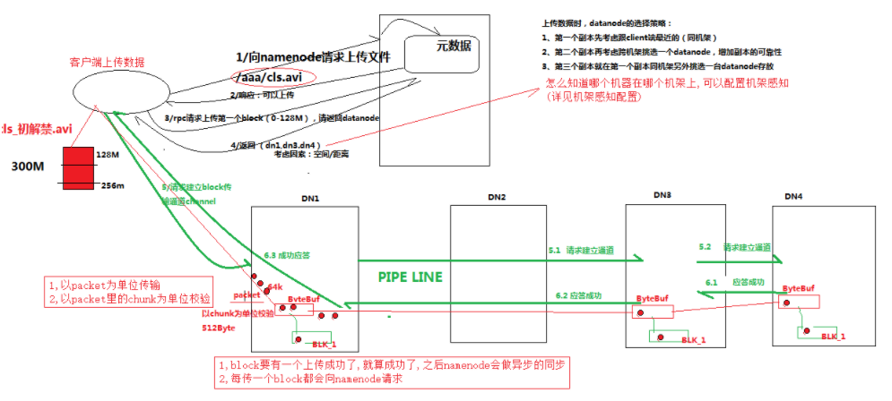
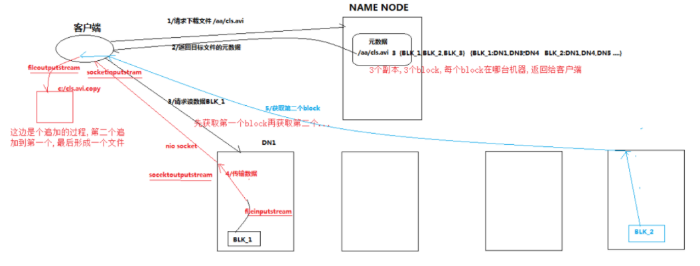
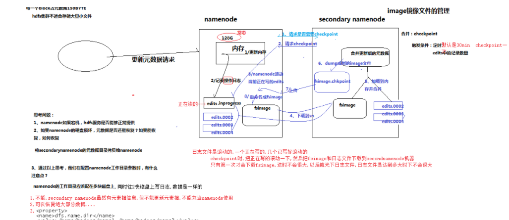
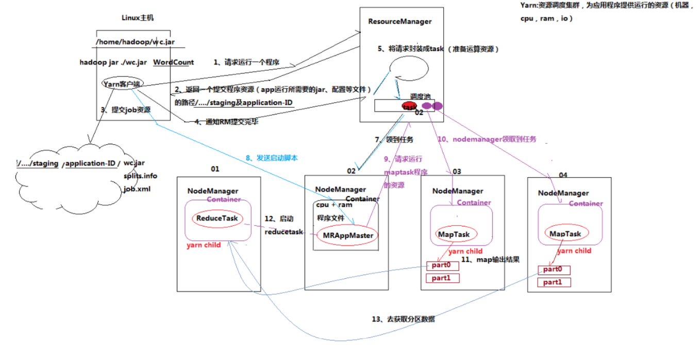
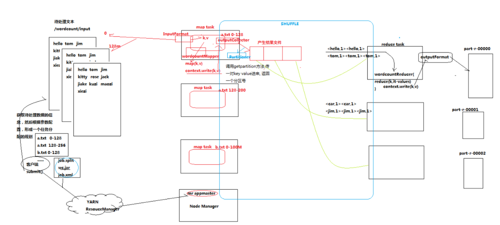
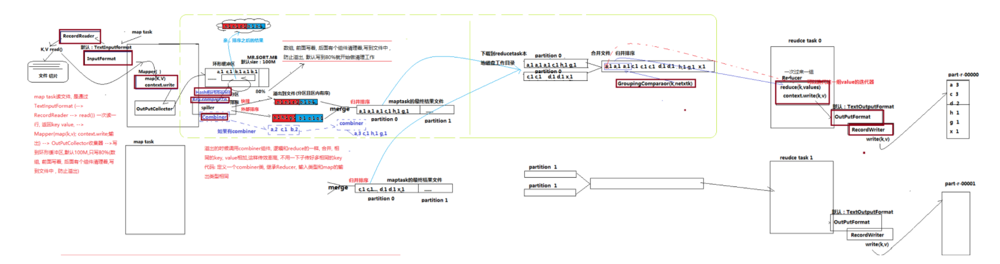
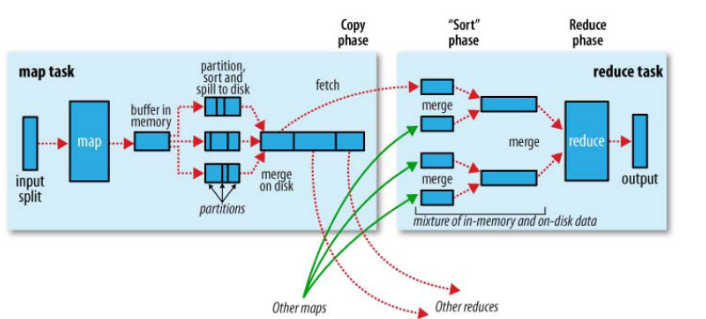

## HDFS原理

### HDFS 工作机制介绍

1. HDFS集群分为两大角色：NameNode、DataNode  (Secondary Namenode)
2. NameNode负责管理整个文件系统的元数据
3. DataNode 负责管理用户的文件数据块
4. 文件会按照固定的大小（blocksize）切成若干块后分布式存储在若干台datanode上
5. 每一个文件块可以有多个副本，并存放在不同的datanode上
6. Datanode会定期向Namenode汇报自身所保存的文件block信息，而namenode则会负责保持文件的副本数量
7. HDFS的内部工作机制对客户端保持透明，客户端请求访问HDFS都是通过向namenode申请来进行

### HDFS 写数据流程



1. 客户端与namenode通信请求上传文件，namenode检查目标文件是否已存在，父目录是否存在
2. namenode返回是否可以上传
3. client请求第一个 block该传输到哪些datanode服务器上
4. namenode返回可以上传的节点, 示例3个datanode服务器ABC
5. client请求3台dn中的一台A上传数据（本质上是一个RPC调用，建立pipeline），A收到请求会继续调用B，然后B调用C，将整个pipeline建立完成，逐级返回客户端
6. client开始往A上传第一个block（先从磁盘读取数据放到一个本地内存缓存），以packet为单位(chunk为校验单位)，A收到一个packet就会传给B，B传给C；A每传一个packet会放入一个应答队列等待应答
7. 当一个block传输完成之后(只要有一个节点上传成功，就算成功)，client再次请求namenode上传第二个block的服务器。

### HDFS 读数据流程



1. client跟namenode通信查询元数据，找到文件块所在的datanode服务器
2. cilent挑选一台datanode（就近原则，然后随机）服务器，请求建立socket流
3. datanode开始发送数据（从磁盘里面读取数据放入流，以packet为传输单位，chunk为校验单位）
4. 客户端以packet为单位接收，先在本地缓存，然后写入目标文件

## NameNode

### Namenode 工作内容

**职责**

- 负责客户端请求的响应
- 元数据的管理（查询，修改）

**元数据管理**

- 内存元数据(NameSystem)
- 磁盘元数据镜像文件(fsimage)
- 数据操作日志文件(edits文件，可以通过日志运算出元数据)

**元数据存储机制**

1. 内存中有一份完整的原数据(内存metadate)
2. 磁盘中有一个"准完整"的原数据镜像(fsimage)文件(在namenode的工作目录中)
3. 用于衔接metadata和持久化元数据镜像的fsimage之间的操作日志(edits文件), 当客户端对hdfs中的文件进行新增或者修改操作，操作记录会首先被记录到edits日志文件中，当客户端操作成功后，相应的原数据会更新到内存meta.data中， 并且每隔一定的间隔hdfs会将当前的metadata同步到fsimage镜像文件中

### 元数据checkpoint机制

由于在数据备份的时候会占用计算资源，所以为了减轻namenode的负载，通常可以将数据备份的工作交给另外一个专门用来做数据备份的namenode--> sencondary namenode

每隔一段时间，会由secondary namenode 将namenode上积累的所有edits和一个最新的fsimage下载到本地(只有第一次merge才会下载fsimage)，并加载到内存进行merge(这个过程称之为checkpoint)



### namenode的一些情况

**namenode如果宕机，hdfs是否还能正常提供服务**

不能，secondarynamenode虽然有元数据信息，但是不能更新元数据， 不能充当namenode使用

**如果namenode的硬盘损坏，元数据是否能回复，能恢复多少?**

可以恢复最后一次merge之前的数据， 只需要将secondarynamenode的数据目录替换成namenode的数据目录

**配置namenode的工作目录时，有哪些可以注意的事项**

可以将namenode的元数据保存到多块物理磁盘上例如如下的namenode配置

### 元数据目录文件介绍

#### VEERSION文件

VERSION文件是Java属性文件，内容大致如下：

```shell
#Fri Nov 15 19:47:46 CST 2013
namespaceID=934548976
clusterID=CID-cdff7d73-93cd-4783-9399-0a22e6dce196
cTime=0
storageType=NAME_NODE
blockpoolID=BP-893790215-192.168.24.72-1383809616115
layoutVersion=-47
```

1. namespaceID是文件系统的唯一标识符，在文件系统首次格式化之后生成的；

2. storageType说明这个文件存储的是什么进程的数据结构信息（如果是DataNode，storageType=DATA_NODE）；

3. cTime 属性标记了 namenode 存储系统的创建时间（即FSImage对象），对于刚刚格式化的存储系统，这个属性为 0； 但是在文件系统升级之后，该值会更新到新的时间戳。

4. layoutVersion：表示HDFS永久性数据结构的版本信息， 只要数据结构变更，版本号也要递减，此时的HDFS也需要升级，否则磁盘仍旧是使用旧版本的数据结构，这会导致新版本的NameNode无法使用

5. clusterID是系统生成或手动指定的集群ID，在-clusterid选项中可以使用它；如下说明

   ```shell
   # 使用如下命令格式化一个Namenode：选择一个唯一的cluster_id，并且这个cluster_id不能与环境中其他集群有冲突。如果没有提供cluster_id，则会自动生成一个唯一的ClusterID。
   hadoop namenode -format -clusterId <cluster_id>
   
   # 升级集群至最新版本。在升级过程中需要提供一个ClusterID，如果没有提供ClusterID，则会自动生成一个ClusterID。
   hadoop start namenode --config $HADOOP_CONF_DIR  -upgrade -clusterId <cluster_ID>
   ```

6. blockpoolID是针对每一个Namespace所对应的blockpool的ID，上面的这个BP-893790215-192.168.24.72-1383809616115就是在我的ns1的namespace下的存储块池的ID，这个ID包括了其对应的NameNode节点的ip地址。

**seen_txid文件**

是存放transactionId的文件，format之后是0，它代表的是namenode里面的edits_*文件的尾数，namenode重启的时候，会按照seen_txid的数字，循序从头跑edits_0000001~到seen_txid的数字。所以当你的hdfs发生异常重启的时候，一定要比对seen_txid内的数字是不是你edits最后的尾数，不然会发生建置namenode时metaData的资料有缺少，导致误删Datanode上多余Block的资讯。

文件中记录的是edits滚动的序号，每次重启namenode时，namenode就知道要将哪些edits进行加载。

**fsimage文件和edits文件**

fsimage: 元数据的镜像文件

edits: 元数据的滚动日志文件，每次merge之后会对之前的日志文件进行清除

## MAPREDUCE

### MAPREDUCE 的运行实例

1. MRAppMaster: 负责整个程序的过程调度以及状态协调
2. mapTask: 负责map阶段的整个数据处理流程
3. ReduceTask: 负责reduce阶段的整个数据处理流程

### YARN的角色

1. yarn中的主管角色叫ResourceManager
2. yarn中具体提供运算资源的角色叫NodeManager

### MR运行任务的流程





1. 一个mr程序启动的时候，最先启动的是MRAppMaster，MRAppMaster启动后根据本次job的描述信息，计算出需要的maptask实例数量，然后向集群申请机器启动相应数量的maptask进程

2. maptask进程启动之后，根据给定的数据切片范围进行数据处理，主体流程为：

   a. 利用客户指定的inputformat来获取RecordReader读取数据，形成输入KV对

   b. 将输入KV对传递给客户定义的map()方法，做逻辑运算，并将map()方法输出的KV对收集到缓存

   c. 将缓存中的KV对按照K分区排序后不断溢写到磁盘文件

3. MRAppMaster监控到所有maptask进程任务完成之后，会根据客户指定的参数启动相应数量的reducetask进程，并告知reducetask进程要处理的数据范围（数据分区）

4. Reducetask进程启动之后，根据MRAppMaster告知的待处理数据所在位置，从若干台maptask运行所在机器上获取到若干个maptask输出结果文件，并在本地进行重新归并排序，然后按照相同key的KV为一个组，调用客户定义的reduce()方法进行逻辑运算，并收集运算输出的结果KV，然后调用客户指定的outputformat将结果数据输出到外部存储

### MapReduce运行原理图



### MAPREDUCE的shuffle机制

#### shuffle机制概述

- mapreduce中，map阶段处理的数据如何传递给reduce阶段，是mapreduce框架中最关键的一个流程，这个流程就叫shuffle(如上图绿色框部分)；
- shuffle: 洗牌、发牌 ——（核心机制：数据分区，排序，缓存）；
- 具体来说：就是将maptask输出的处理结果数据，分发给reducetask，并在分发的过程中，对数据按key进行了分区、合并和排序；

#### shuffle主要流程



shuffle是MR处理流程中的一个过程，它的每一个处理步骤是分散在各个mapTask和reduceTask几点上完成的，主要有3个动作:

1. 将结果分区
2. 根据key进行排序
3. 使用Combiner进行局部排序

在整个流程中有几个关键的步骤:

1. 对缓冲区输出的结果进行分区和排序， 数据的分区和排序最开始行程的位置
2. 对碎片数据的合并，包含第一次从缓冲区经过排序分区的结果，以及每个taskMap输出的结果，并且都会经过combine整合
3. 对不同mapTask的分区结果进行整合

#### shuffle的详细流程

1. maptask收集我们的map()方法输出的kv对，放到内存缓冲区中
2. 从内存缓冲区不断溢出本地磁盘文件，可能会溢出多个文件
3. 多个溢出文件会被合并成大的溢出文件
4. 在溢出过程中，及合并的过程中，都要调用partitoner进行分组和针对key进行排序
5. reducetask根据自己的分区号，去各个maptask机器上取相应的结果分区数据
6. reducetask会取到同一个分区的来自不同maptask的结果文件，reducetask会将这些文件再进行合并（归并排序）
7. 合并成大文件后，shuffle的过程也就结束了，后面进入reducetask的逻辑运算过程（从文件中取出一个一个的键值对group，调用用户自定义的reduce()方法） 

> Shuffle中的缓冲区大小会影响到mapreduce程序的执行效率，原则上说，缓冲区越大，磁盘io的次数越少，执行速度就越快 
>
> 缓冲区的大小可以通过参数调整,  参数：io.sort.mb  默认100M

### Mapreduce 一些问题

1. 自定义分区:  自定义Partitioner类(继承partitioner)
2. 对map的中间结果进行合并: 自定义Combine(继承Reducer)类
3. 对自定义Bean进行分组: 自定义GroupingComparator继承(WritableComparator), 实现Compare方法
4. 实现灵活的文件读取和文件输出，通过自定义inputformat和outputformat
5. 全局计数，通过context.getCounter()